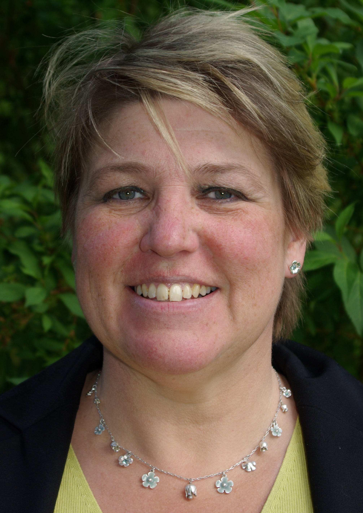

### Sigrid Eldh

Dr. Sigrid Eldh is a researcher and senior specialist at Ericsson Radio System & Technology, where she leads the Ericsson research on software test and product quality. She is an Adjunct Professor at Carleton University and a Senior Lecturer at Mälardalens University.  Sigrid has more than 30 years of practical experience from the IT-Industry. She has started SAST, ISTQB, and SSTB.

### Testing Ultra Large Complex Systems - Past, Present and Future
This presentation discusses Telecommunications system – from a strong quality focus in a leveled V (or should I say Iterative W?) model of development to our current Agile development. With a decade of Agile development and test, we are finally getting closer to the DevOps vision. This transformation is challenging for our type of systems – Ultra Large scale embedded with proprietary multi/many-core hardware. On top of this explosion of our software IoT is around the corner –“everything connected” – from cloud to micro-services on devices. Testing through these times are in many ways the same, yet, it is easy to observe a series of fundamental changes. I will focus on these changes, e.g. test automation vs. manual approaches, know-how on testing, test environment, test analysis and other aspects of testing.  This presentation will give you a “state-of-practice” example on testing in the real world.
