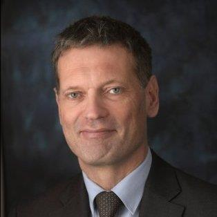

### Hans Wanders

Hans Wanders is the CIO for the Dutch central government (“CIO Rijk”) at the Ministry of the Interior and Kingdom Relations in The Hague.    In that capacity, he is also head of the BIT (<https://www.bureauicttoetsing.nl/>) (Bureau ICT Toetsing), which provides advice on all large ICT projects within the central government.   Before becoming CIO Rijk, Hans was global CIO for Randstad.   He also worked for Philips Electronics and McKinsey and Company.  Hans studied Mathematics at the Eindhoven University of Technology.

### Software in the Dutch government
The Dutch government is becoming increasing digital and therefore is a large user of software and ICT tools.   It also creates a lot of its own software.    In his talk, Hans will explore the challenges of steering and managing the digitization process within this complex organization.    A first impression can be found in the newly published Strategic I-agenda for the central government (“Strategische I-agenda Rijksdienst (<https://www.rijksoverheid.nl/documenten/rapporten/2016/12/02/rapport-strategische-i-agenda-rijksdienst>)”, in Dutch).   Hans will also address some of the pitfalls of large software projects within the government and the role of the BIT (<https://www.bureauicttoetsing.nl/>).   Together with the audience, Hans hopes to explore how and where the software engineering community can help the government address some of its challenges.
 

