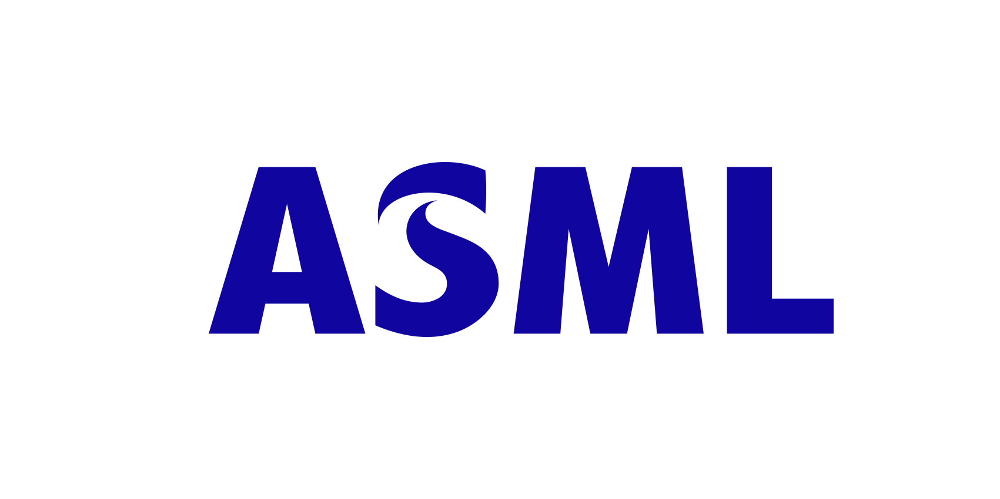

The 11th Dutch national symposium on software engineering (SEN) will be held at CWI, Amsterdam, on Friday, 23 May 2025.

  
At this symposium we bring together the Dutch software engineering, programming languages, and formal methods community. SEN symposium is organized by VERSEN, the <a href="https://www.versen.nl/">Dutch National Association
for Software Engineering</a>. 
The program will feature keynotes, invited presentations, and contributed “lightning talks”.

  
We have the following confirmed keynote and invited speakers:
<ul>
    <li> <a href="https://www.cs.uni-salzburg.at/~anas/">Ana Sokolova</a>, University of Salzburg, Austria </li>
    <li> <a href="https://www.fim.uni-passau.de/en/chair-for-software-engineering-ii">Gordon Fraser</a>, University of Passau, Germany </li>
    <li> <a href="https://burcuku.github.io/home/">Burcu Ozkan</a>,  Delft University of Technology, the Netherlands</li>
    <li> <a href="https://lmove.github.io/">Lina Ochoa Venegas</a>, Eindhoven University of Technology, the Netherlands</li>
    <li> <a href="https://tobias.kap.pe/">Tobias Kappé</a>, Leiden University, the Netherlands</li>
</ul>
<!--- 

 For further details on the speeches kindly refer to <a href="speakers/index.html">Speakers</a> page. 
 
 --->

Organising committee:
<ul>

<li><a href="https://alfons.laarman.com/">Alfons Laarman</a>,  Leiden University</li>
<li><a href="https://mairieli.com/">Mairieli Wessel</a>, Radboud University</li>
<li><a href="https://malihehizadi.github.io/PersonalWebsite/">Maliheh Izadi</a>, Delft University of Technology</li>

<li><a href="https://homepages.cwi.nl/~storm/">Tijs van der Storm</a>, Centrum Wiskunde & Informatica, University of Groningen (local organisation)</li>
</ul>

<!--- 

We thank ASML for the generous sponsorship this year.  
 

 -->
<!-- <a href="/program/">check our program</a> and <a href="/registration/">register for free participation.</a> -->
